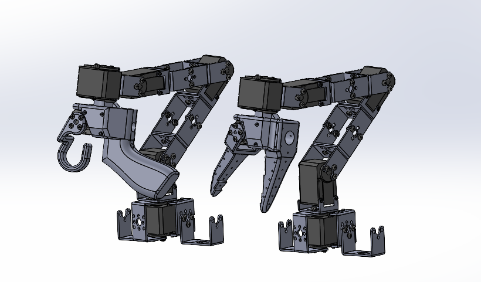

# moss-robot-arms
moss-robot-arms Beta version 1.0.

A repository for affordable, easy-to-assemble robot arms designed for teleoperation applications. Note: This initial version arm uses the [SO-100 Arm](https://github.com/TheRobotStudio/SO-ARM100) Gripper. Future iterations will have an off the shelf gripper.

## Assembly Instructions

## Sourcing Parts
Note: The follower and leader arm for this teleoperation setup will have the same off the shelf parts. If you plan on creating the classic teleoperation set up to be used with the `LeRobot` library please buy from the Parts for 2 arms below. Note prices and items may vary slightly depending on geographic location.

/!\ Warning: We only have links for US and EU for now. If you find links for other countries, please create an issue or PR so that we add them to the list.

### Parts For Two Arms (Standard Teleoperation Setup):
 
| Part | Amount | Unit Cost (US) | Buy US | Unit Cost (EU) | Buy EU |
|---|---|---|---|---|---|
| STS3215 Servo | 12 | $14 | [Alibaba](https://www.alibaba.com/product-detail/_1601053797763.html) | 13€ | [Alibaba](https://www.alibaba.com/product-detail/_1601053797763.html) |
| Motor Control Board | 2 | $5 | [Waveshare](https://www.waveshare.com/bus-servo-adapter-a.htm) - [Amazon](https://www.amazon.com/Control-Circuit-Suitable-Supports-Controlling/dp/B0CKT8BN73/ref=asc_df_B0CKT8BN73/) | 4€ | [Waveshare](https://www.waveshare.com/bus-servo-adapter-a.htm)-[Amazon](https://www.amazon.fr/-/en/dp/B0CJ6RYC9J/ref=sr_1_3)|
| Bracket Set | 18 | $3 | [Alibaba](https://www.alibaba.com/product-detail/STS3215-Metal-brackets-for-FEETECH-7_1600836829515.html) | 2€ | [Alibaba](https://www.alibaba.com/product-detail/STS3215-Metal-brackets-for-FEETECH-7_1600836829515.html) |
| USB-C Cable 2 pcs | 1 | $7 | [Amazon](https://www.amazon.com/Charging-etguuds-Charger-Braided-Compatible/dp/B0B8NWLLW2/?th=1) | 7€ | [Amazon](https://[www.amazon.com/Charging-etguuds-Charger-Braided-Compatible/dp/B0B8NWLLW2/?th=1](https://www.amazon.fr/dp/B07BNF842T/)) |
| Power Supply | 2 | $10 | [Amazon](https://www.amazon.com/Facmogu-Switching-Transformer-Compatible-5-5x2-1mm/dp/B087LY41PV/) | 13€ | [Amazon](https://www.amazon.fr/-/en/dp/B01HRR9GY4/) |
| Table Clamp 2pcs | 2 | $9 | [Amazon](https://www.amazon.com/Mr-Pen-Carpenter-Clamp-6inch/dp/B092L925J4/) | 8€ | [Amazon](https://www.amazon.fr/-/en/dp/B08HZ1QRBF/)|
| Lowstrength Threadlocker[1](#myfootnote1) | 1 | $9 | [Amazon](https://www.amazon.com/Loctite-Threadlocker-Automotive-High-Temperature-Non-Corrosive/dp/B0002KKTT0/)| 11€ | [Amazon](https://www.amazon.fr/-/en/dp/B000HBGHFY/) |
| Screwdriver Set (includes Phillips #000, #00, #0, #1) | 1 | $6 | [Amazon](https://www.amazon.com/Precision-Phillips-Screwdriver-Electronics-Computer/dp/B0DB227RTH) | 10€ | [Amazon](https://www.amazon.fr/dp/B08ZXVMVYD/) |
| Wrench[2](#myfootnote2) | 1 | $5 | [Amazon](https://www.amazon.com/uxcell-Metric-Double-Wrench-5-5mm/dp/B07D4B8GWW/) | 4€ | [Amazon](https://www.amazon.fr/-/en/dp/B075DML8KB/) |
| M3 Washers[3](#myfootnote3) | 1 | $2 | [Amazon](https://www.amazon.com/Hillman-Group-7606-Washers-10-Pack/dp/B00G5IZWQS/) | 4€ | [Amazon](https://www.amazon.fr/-/en/dp/B0CVNBW6RL/) |
| Total |---| $299 |---| 278€ |---|

### Parts for One Arm:
| Part | Amount | Unit Cost (US) | Buy US | Unit Cost (EU) | Buy EU |
|---|---|---|---|---|---|
| STS3215 Servo | 6 | $14 | [Alibaba](https://www.alibaba.com/product-detail/_1601053797763.html) | 13€ | [Alibaba](https://www.alibaba.com/product-detail/_1601053797763.html) |
| Motor Control Board | 1 | $5 | [Waveshare](https://www.waveshare.com/bus-servo-adapter-a.htm) - [Amazon](https://www.amazon.com/Control-Circuit-Suitable-Supports-Controlling/dp/B0CKT8BN73/ref=asc_df_B0CKT8BN73/) | 4€ | [Waveshare](https://www.waveshare.com/bus-servo-adapter-a.htm)-[Amazon](https://www.amazon.fr/-/en/dp/B0CJ6RYC9J/ref=sr_1_3)|
| Bracket Set | 9 | $3 | [Alibaba](https://www.alibaba.com/product-detail/STS3215-Metal-brackets-for-FEETECH-7_1600836829515.html) | 2€ | [Alibaba](https://www.alibaba.com/product-detail/STS3215-Metal-brackets-for-FEETECH-7_1600836829515.html) |
| USB-C Cable 2 pcs | 1 | $7 | [Amazon](https://www.amazon.com/Charging-etguuds-Charger-Braided-Compatible/dp/B0B8NWLLW2/?th=1) | 7€ | [Amazon](https://[www.amazon.com/Charging-etguuds-Charger-Braided-Compatible/dp/B0B8NWLLW2/?th=1](https://www.amazon.fr/dp/B07BNF842T/)) |
| Power Supply | 1 | $10 | [Amazon](https://www.amazon.com/Facmogu-Switching-Transformer-Compatible-5-5x2-1mm/dp/B087LY41PV/) | 13€ | [Amazon](https://www.amazon.fr/-/en/dp/B01HRR9GY4/) |
| Table Clamp 2pcs | 1 | $9 | [Amazon](https://www.amazon.com/Mr-Pen-Carpenter-Clamp-6inch/dp/B092L925J4/) | 8€ | [Amazon](https://www.amazon.fr/-/en/dp/B08HZ1QRBF/)|
| Lowstrength Threadlocker[1](#myfootnote1) | 1 | $9 | [Amazon](https://www.amazon.com/Loctite-Threadlocker-Automotive-High-Temperature-Non-Corrosive/dp/B0002KKTT0/)| 11€ | [Amazon](https://www.amazon.fr/-/en/dp/B000HBGHFY/) |
| Screwdriver Set (includes Phillips #000, #00, #0, #1) | 1 | $6 | [Amazon](https://www.amazon.com/Precision-Phillips-Screwdriver-Electronics-Computer/dp/B0DB227RTH) | 10€ | [Amazon](https://www.amazon.fr/dp/B08ZXVMVYD/) |
| Wrench[2](#myfootnote2) | 1 | $5 | [Amazon](https://www.amazon.com/uxcell-Metric-Double-Wrench-5-5mm/dp/B07D4B8GWW/) | 4€ | [Amazon](https://www.amazon.fr/-/en/dp/B075DML8KB/) |
| M3 Washers[3](#myfootnote3) | 1 | $2 | [Amazon](https://www.amazon.com/Hillman-Group-7606-Washers-10-Pack/dp/B00G5IZWQS/) | 4€ | [Amazon](https://www.amazon.fr/-/en/dp/B0CVNBW6RL/) |
| Total |---| $165 |---| 157€ |---|

## Printing the Parts
A variety of 3D printers are acceptable to print the parts necessary of the follower and leader arm. Follow the steps below to ensure a good print.

1. Choose a printer: When choosing a printer there are a variety of factors to consider. Below are the suggested printed settings, although using a printer outside these parameters may likely work as well.
   1. Precision: 0.2mm minimum height layer[4](#myfootnote5)
   2. Material: PLA+, ABS, PETG or other reasonably strong plastics.
   3. Nozzle Diameter: 0.4mm maximum nozzle diameter
   4. Infill Density: ~30% [5](#myfootnote5)
   5. Sample Printers: [Prusa Mini+](https://www.prusa3d.com/product/original-prusa-mini-semi-assembled-3d-printer-4/), [Bambu P1](https://us.store.bambulab.com/collections/p1-series/products/p1p), [Ender3](https://www.amazon.com/Comgrow-Creality-Ender-Aluminum-220x220x250mm/dp/B07BR3F9N6/), etc.  
2. Set up the printer
   1. Materials:[6](#myfootnote6)
      1. [Standard Glue Stick](https://www.amazon.com/Amazon-Basics-Washable-School-Sticks/dp/B0CRCWCGNW/)
      2. [Putty Knife](https://www.amazon.com/Warner-ProGrip-Putty-Knife-90133/dp/B000I1VEK6/)
   2. Setup and Takedown
      1. Ensure that the printer is calibrated and the bed level is correctly set using the printer specific instructions.
      2. Clean the print bed, making sure it is free from dust, or grease. If cleaning the bed using water, or other liquid, dry the bed.
      3. Use a standard glue stick and apply a thin, even layer of glue across the print area of the bed. Avoid clumping or uneven application.
      4. Load the printer filament using printer specific instructions.
      5. Ensure the printer settings match the ones suggested above (most printers have multiple settings so choose the ones that most closely match).
      6. Check file type, choose the file(s) from the hardware folder and print.[7](#myfootnote7)
3. Print the two files found in `so_100_gripper_parts`, which are listed below.
   1. `Print_Follower_SO_ARM100_08k_Gripper.STL`
   2. `Print_Leader_SO_ARM100_08k_Gripper.STL`
4. Take Down
   1. After the print is done, use the putty knife to scrape the the parts off the print bed.
   2. Remove any support material from parts.
   3. Reapply the glue stick before starting the next print.

## Assembling the Parts
Construct the leader and follower arms using the Assembly Video linked below. After you assemble the two arms from the video, power the leader and follower arm using the 5V power supplies. In addition, plug each arm into your computer using a USB-C cable.

TODO(jess-moss): Add assembly video.

## Configure
While this robot can be programmed in a variety of manners, it is suggested to use with [LeRobot](https://github.com/huggingface/lerobot/blob/main/examples/7_get_started_with_real_robot.md).

Join the project for support and development on the [discord server](https://discord.gg/ggrqhPTsMe).

## Footnotes
<a name="myfootnote1">1</a>: While Loctite is not strictly necessary, it does help to ensure screws do not loosen overtime, and is recommended whenever you have a the M3 screw fastening into the M3 nut. You only need a small dot of it. \
<a name="myfootnote2">2</a>: You can either use a 5.5mm or 7/32" wrench, as they are both compatible with the M3 nuts. In a pinch you can also use needle-nose or other pliers but a wrench does help with assembly. \
<a name="myfootnote3">3</a>: The screws provided with the Bracket Set are actually slightly too long for the motor horn on the idler side. You can buy M3 washer (they do not need to be these exact ones) to ensure a tight fit. \
<a name="myfootnote4">4</a>: This precision is based on the fact the through holes for M2 fasteners are 2.4mm in diameter while the nominal diameter of a M2 fastener is 2mm. In a worst case scenario, this allows +/- 0.2mm while still allowing for screw alignment. However, if you are only capable of printing with a larger layer height, you will likely be fine, just ensure the screw holes align as expected.\
<a name="myfootnote5">5</a>: It is quite possible a lower density infill could be used, however, erring on the side of caution, I used 37% to ensure strong parts.  \
<a name="myfootnote6">6</a>: You do not need to buy these exact parts, but a glue stick and putty knife are almost always necessary for a good 3D print. The glue prevents parts from sticking to the print bed, and the putty knife helps scrape parts from the print bed. However, feel free to check with your specific printer instructions for if these parts are necessary. \
<a name="myfootnote7">7</a>: All the printers suggested will print STL files. However, if your printer only prints a different format, ensure you convert the file to the correct extension before printing.